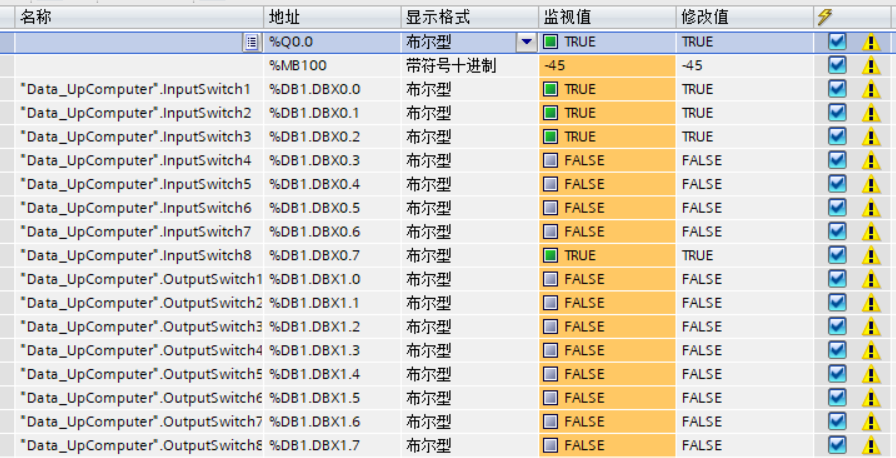
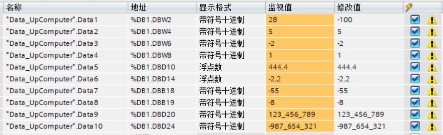

# 项目名称：MyS7NetPlus

## 1.项目简介
一个基于S7netplus的demo。

- 目标：学习S7netplus的使用
- 适用场景：学习练习项目
- 简要说明：一个可基于json配置的S7netplus demo

## 2.技术栈
|分类|内容|
|---|---|
|框架|.NET 8|
|UI|WinForm|
|通信|S7netplus框架|
|数据库|SQLite Microsoft.Data.Sqlite|
|其他Nuget|NLog、Dapper、ScottPlot、Newtonsoft.Json等|

## 3.主要功能清单

- 开启Kestrol web server作为WebApi，以便支持MES下发命令
- 基于 device -> group -> tag 配置的点位配置json
- 每次采集时，按单个group一次性连续读取该group下所有点位数据
- 断线自动重连
- UI日志、物理日志、数据库日志(采集、报警)
- DataGridView中阶梯式预警和报警高亮显示(正常<->预警<->报警)
- 点位轮询采集、分group显示点位列表，以及各个点位的编辑、实时曲线、报警历史
- 关闭程序时确保入库数量和采集数量一致后才能关闭

## 4.运行前置条件
- .NET 8
- 测试工具：博途软件、PLCSIM仿真、NetToPLCsim

## 5.快速启动步骤
1. 用 git clone 命令下载源码到本地
2. 用VS打开源码中的 MyS7NetPlus.slnx
3. 打开博途软件项目
    - 配置项目允许开启仿真
    - 设计时配置配置设备的IP
    - 开启PUT/GET远程访问
    - 取消数据块优化(如果需要用DB块的话)
    - 按 附录 截图中的样子配置数据块和监控表
    - 下载数据结构到PLC设备，启动PLCSIM仿真
    - 监视中监视全部，并立即修改全部
4. 配置NetToPLCsim并start server
5. 在VS中直接start项目，它会自动启动MyS7NetPlus.UI.exe

## 6.关键设计说明
基于第一个MyModbusTCP的设计思路，使用json配置加载所有点位配置，UI上用 TabControl + DataGirdView 来显示按group显示该group下所有点位列表

### 6.1 通信层
- 扩展了S7netplus的Plc类，新增如下泛型方法：
    - ReadAsync\<T>
    - WriteAsync\<T>
- 实现了如下功能：
    - modbus各种数据类型和byte之间的转换工具类封装
    - 大小字、高低字节处理
    - 异常处理、采集超时处理
    - 断线重连机制
    - 自研S7Context上下文类来控制S7netplus中Plc类型实例的连接和断开，以及处理采集Task、发送Task
    - 主Form中处理持久化Task来入库每个点位的采集结果
    - 发送Task中循环从发送队列中出列处理并返回TCS的结果
    - 基于CancellationTokenSource(CTS)的cancel信号
    - 基于TaskCompletionSouce(TCS)的异步等待信号处理
    - 发送队列、持久化(入库)队列由各自Task循环出列处理
    - 实现入库批量处理
    - 实现消息总线来发布和订阅消息

### 6.2 数据存储
- SQLite数据库: 所有采集数值统一由持久化队列存入数据库的TagLog表，点位数值变化(正常<->预警<->报警)记录到AlarmLog中。
- 日志：用NLog做物理日志存储，Winform和WebApi日志相互独立。

### 6.3 UI架构（WinForm）
- WinForm：事件驱动，后台轮询跨线程更新UI处理。

## 7.附录

博途软件工程项目中监视与强制表中自己新建的监控表的配置

